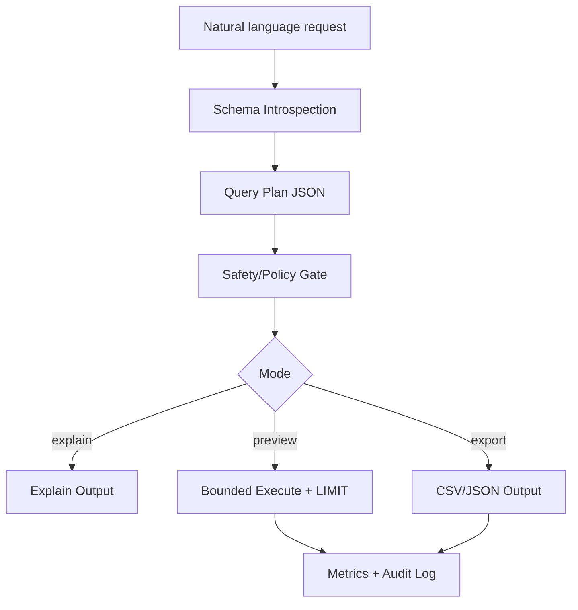

# 🧠Q-Forge
### AI Query Planning, Safety & Performance Control Plane
Translating natural-language questions into safe, efficient, production-ready SQL.

Q-Forge is a production-grade MCP server that transforms natural-language questions into safe, optimized, auditable SQL queries — with a strong, explicit focus on performance, correctness, and control.
This project was built from a real infrastructure mindset:
every query is a potentially dangerous, expensive operation — and must be planned, validated, measured, and governed

---

## Background / Motivation
This project is a direct continuation of my previous work on AI infrastructure.
In a prior project, I focused on GPU-based inference systems, where performance measurement, bottleneck analysis, and efficiency were not optional — they were the core of the system.
Working on large-scale inference made one thing very clear:
a system that is “correct” but inefficient is not production-ready.
While that project operated in the GPU and inference domain, the same realization applies even more strongly to databases and query execution.
In environments such as banks or enterprise data platforms,
There is no room for unnecessary latency, and דscripts must never block or degrade the system.
This insight led to the core idea behind Q-Forge:
building not just an NL→SQL translator, but a control plane that understands the database, validates intent, and executes queries safely and efficiently.


---

##🔥 What Makes It Different

- **Database-aware NL→SQL engine** : 
  Natural-language questions are translated into correct SQL by reasoning over the actual database schema (LLM).
- **Explicit schema & relationship understanding**  :
  The system introspects tables, columns, foreign keys, and join paths, and builds a structured internal representation of the database that can be exposed as plans or diagrams.
- **Plan-first lifecycle**: every request produces a Query Plan JSON, so the policy engine can evaluate intent and risk before execution.
- **Stage-level metrics**: planning, validation, explain, and execution timings are captured for performance analysis.
- **Explain/preview modes**: safe modes return EXPLAIN output or bounded results before any full execution.
- **Deterministic caching**: schema fingerprints key the plan cache to reduce recomputation on unchanged metadata.
- **Policy-driven safety**: writes are blocked by default; explicit allowlists and rule checks decide what can execute.


---

## Core Query Lifecycle

1. **Plan**: build a structured Query Plan (JSON).
2. **Validate**: policy engine checks for safety and allowed operations.
3. **Explain**: optional EXPLAIN and heuristic estimates.
4. **Execute**: bounded execution in preview or explicit full execution.
5. **Audit**: write decisions, metrics, and outcomes to the audit log.

---

## Architecture



Q-Forge follows Clean Architecture:
- **Interfaces (MCP tools)**: transport + tool definitions (`interfaces/mcp/*`).
- **Application layer**: use-cases & orchestration (`application/use_cases/*`, `sql_agent_service.py`).
- **Domain (ports)**: stable interfaces for adapters (`domain/ports.py`).
- **Infrastructure**: SQLAlchemy adapter, DB context, LLM provider, config & logging (`infrastructure/*`).


---

## Safety Guarantees

- Read-only by default; writes require explicit approval.
- Bounded preview execution enforces LIMIT.
- Audit log records decisions, metrics, and outcomes.
- Policy engine returns reasons when a request is blocked.

---

## Non-Goals

- Not a BI or visualization tool.
- Not a chat UI.
- Not an autonomous system that performs writes without approval.

---

## MCP Tools

Core tools:
- `nl_to_sql`: translate NL to SQL (optionally include plan).
- `plan_query`: plan only, no execution.
- `run_sql`: execute SQL with safety + modes.
- `ask_db`: NL -> SQL -> (optional) execute in one call.
- `run_sql_write` / `run_sql_write_approved`: write operations with explicit approval.
- `get_schema` / `get_erd` / `list_tables`: schema utilities.

Execution modes:
- `mode="explain"`: return plan and EXPLAIN only.
- `mode="preview"`: safe limited execution.
- `mode="execute"`: full execution (still policy-bounded).

---

## Tech & Build Principles

- **SQLAlchemy** as the primary DB adapter.
- **DbContext** for consistent access and lifecycle control.
- **Dependency Injection** across layers.
- **DTOs** for clean, safe data transfer.

---

## Quickstart

Create and activate a venv:
```bash
python -m venv venv
```
- Windows: `venv\Scripts\activate`
- macOS/Linux: `source venv/bin/activate`

Install:
```bash
pip install -e .
```

Configure environment in `mcp_sql_agent/app/.env`:
```bash
DB_URL=sqlite:///mcp_sql_agent/app/demo.db
OPENAI_API_KEY=your_api_key_here
OPENAI_MODEL=gpt-4o-mini
LOG_LEVEL=INFO
```

Run the MCP server (stdio transport):
```bash
python -m mcp_sql_agent.app.main
```

Example MCP client config (`mcp.toml`):
```toml
[mcp_servers.q_forge]
command = "C:\\path\\to\\Q-Forge\\venv\\Scripts\\python.exe"
args = ["-m", "mcp_sql_agent.app.main"]
cwd = "C:\\path\\to\\Q-Forge"
```


---

## Tests

```bash
pytest
```

Includes tests for policy enforcement, caching, audit logging, planning, and tool behavior.
