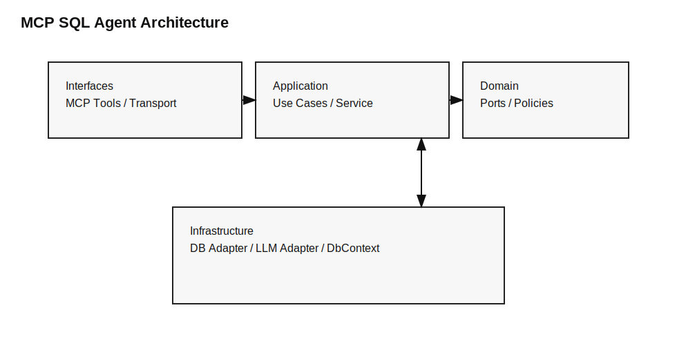

# Q-Forge
### מסלול השליטה לשאילתות הכי מהירות, יעילות ובטוחות

Q-Forge הוא Control Plane מוכן ל‑MCP שממיר שאלות טבעיות לשאילתות SQL **אופטימליות**, מתכנן אותן מראש, מאמת **בטיחות**, ומבצע אותן עם **מדדי ביצועים** ושכבות הגנה.

זה לא עוד “NL‑to‑SQL”. זה **מנוע חיים מלא לשאילתה**: תכנון, ולידציה, הסבר, מדידה ובקרה.

---

## למה הפרויקט הזה מיוחד

- **המהירות במקום הראשון**: כל העיצוב מכוון לשאילתות הכי מהירות ויעילות שניתן להפיק.
- **אמינות ברמת פרודקשן**: מדדים, לוגים ו‑audit לכל בקשה.
- **בדיקות מקיפות**: יש TESTS לכל רכיב מרכזי – אבטחה, תכנון, ביצוע וכלי MCP.
- **Clean Architecture אמיתי**: הפרדה חדה בין שכבות, ניתוק תלויות, ויכולת החלפה קלה.
- **בנוי נכון לכל DB**: גישה עקבית דרך DbContext, Singleton, הזרקות, DTOs ועוד.

---

## הסיפור מאחורי זה

הרעיון נולד משיחות עם:
- מתכנתת בבנק שהייתה צריכה שכבת שאילתות **מהירה, בטוחה ומדידה** לפרודקשן.
- מנהלת עסק שמחזיקה נתונים ידנית עד היום, ורצתה פתרון פשוט לשאלות אמיתיות מול DB.

הפרויקט נבנה כדי לשרת את שני העולמות: **מהירות ודיוק בארגון גדול**, ו‑**פשטות של קבלת תשובות** בעסק קטן.

---

## צינור העבודה (Core Pipeline)

1. **Plan**: בניית Query Plan מובנה (JSON).
2. **Validate**: בדיקות בטיחות ומדיניות.
3. **Estimate**: הערכת ביצועים ו‑EXPLAIN במידת הצורך.
4. **Execute**: ביצוע מוגבל ומבוקר.
5. **Audit**: תיעוד מלא של ההחלטות והמדדים.

---

## ארכיטקטורה



Q-Forge בנוי לפי **Clean Architecture**:

- **Interfaces (MCP tools)**: הגדרות כלים ו‑transport.
- **Application layer**: תזמור תרחישים ומדיניות.
- **Core engine**: תכנון, ולידציה והסבריות.
- **Infrastructure**: SQLAlchemy, ספקי LLM, Audit logging.

כולל **DbContext בסגנון VDBContext** לשמירה על עקביות גישה, Cache‑awareness ויכולת בדיקה גבוהה.

---

## בטיחות וביצועים

בטיחות היא פיצ’ר מרכזי:
- מצב קריאה בלבד כברירת מחדל.
- כתיבה דורשת אישור מפורש.
- מגבלות LIMIT אוטומטיות.
- חסמי מורכבות (joins, depth, risk).

ביצועים הם חלק מה‑DNA:
- מדדי זמן לתכנון, קומפילציה וביצוע.
- מצב EXPLAIN בלבד.
- ביצוע מוגבל לתצוגה מקדימה.

---

## תכנון שאילתות (לא רק SQL)

כל בקשה יוצרת **Query Plan JSON** לפני ביצוע, כולל:
- intent
- tables + join paths
- filters + aggregations
- group_by / order_by / limit
- confidence score

הכול **ניתן לבקרה, הסבר, דיבוג ואודיט**.

---

## MCP Tools (מה אפשר לקרוא)

כלים מרכזיים:
- `nl_to_sql`: תרגום NL ל‑SQL (אפשר להחזיר גם Plan).
- `plan_query`: תכנון בלבד, בלי ביצוע.
- `run_sql`: ביצוע עם בטיחות ומצבים.
- `ask_db`: NL -> SQL -> (אופציונלי) ביצוע.
- `run_sql_write` / `run_sql_write_approved`: כתיבה עם אישור מפורש.
- `get_schema` / `get_erd` / `list_tables`: כלי סכימה.

מצבי הרצה:
- `mode="explain"`: Plan + EXPLAIN בלבד.
- `mode="preview"`: ביצוע מוגבל ובטוח.
- `mode="execute"`: ביצוע מלא תחת מדיניות.

---

## טכנולוגיה ועקרונות בנייה

- **SQLAlchemy** כאדפטור ראשי למסדי נתונים.
- **DbContext Singleton** לאחידות ויציבות.
- **Dependency Injection** מסודר בכל השכבות.
- **DTOs** להעברת נתונים ברורה ומבוקרת.

---

## הרצה מקומית

```bash
python -m venv venv
```
הפעלה:
- Windows: `venv\Scripts\activate`
- macOS/Linux: `source venv/bin/activate`

התקנה:
```bash
pip install -e .
```

הרצת MCP Server:
```bash
python -m mcp_sql_agent.app.main
```

---

## בדיקות

```bash
pytest
```

בדיקות כוללות: אבטחה, תכנון, caching, audit logging, וכלי MCP.

---

## לא המטרה

- לא BI ולא דשבורד.
- לא UI לצ׳אט.
- לא סוכן אוטונומי שרץ בלי אישור.

---

## בשורה התחתונה

Q-Forge הוא **פרויקט פרודקשן‑גרייד** שנועד להביא את השאילתות **הכי מהירות, יעילות ובטוחות**. הוא נבנה נכון, נבדק נכון, ומוכן לעבוד בכל סביבת DB עם שליטה מלאה על ביצועים ומדיניות.
