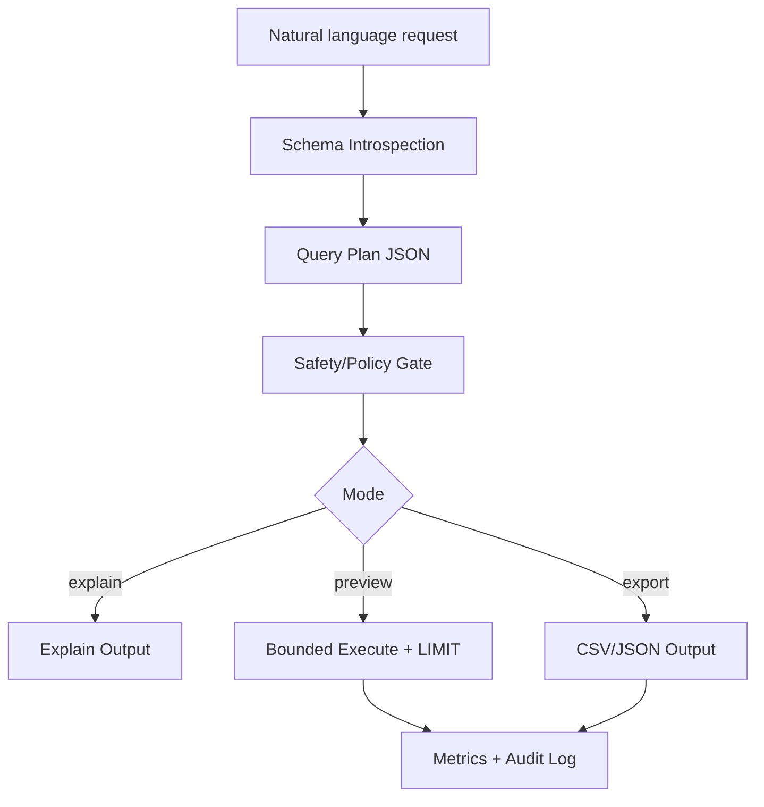

# Q-Forge
### AI Query Planning, Safety & Performance Control Plane

Q-Forge is an MCP-ready control plane that turns natural-language requests into SQL through a structured query lifecycle: plan, validate, explain, execute (bounded), and measure. It emphasizes safety gates, policy reasoning, and measurable performance metrics rather than opaque SQL generation.

---

## Background / Motivation

I built AI infrastructure with a focus on performance analysis (GPU/inference). The same mindset maps to database query safety and efficiency: plan first, enforce guardrails, and expose metrics at each stage of the query lifecycle. Q-Forge applies those principles to SQL generation and execution through explicit planning, policy enforcement, and auditability.

---

## What Makes It Different

- **Plan-first lifecycle**: every request produces a Query Plan JSON, so the policy engine can evaluate intent and risk before execution.
- **Policy-driven safety**: writes are blocked by default; explicit allowlists and rule checks decide what can execute.
- **Stage-level metrics**: planning, validation, explain, and execution timings are captured for performance analysis.
- **Explain/preview modes**: safe modes return EXPLAIN output or bounded results before any full execution.
- **Deterministic caching**: schema fingerprints key the plan cache to reduce recomputation on unchanged metadata.

---

## Core Query Lifecycle

1. **Plan**: build a structured Query Plan (JSON).
2. **Validate**: policy engine checks for safety and allowed operations.
3. **Explain**: optional EXPLAIN and heuristic estimates.
4. **Execute**: bounded execution in preview or explicit full execution.
5. **Audit**: write decisions, metrics, and outcomes to the audit log.

---

## Architecture



Q-Forge follows Clean Architecture:
- **Interfaces (MCP tools)**: transport and tool definitions.
- **Application layer**: query lifecycle orchestration and modes.
- **Core engine**: planning, validation, and explainability.
- **Infrastructure**: SQLAlchemy adapters, LLM providers, and audit logging.

---

## Safety Guarantees

- Read-only by default; writes require explicit approval.
- Bounded preview execution enforces LIMIT.
- Audit log records decisions, metrics, and outcomes.
- Policy engine returns reasons when a request is blocked.

---

## Non-Goals

- Not a BI or visualization tool.
- Not a chat UI.
- Not an autonomous system that performs writes without approval.

---

## MCP Tools

Core tools:
- `nl_to_sql`: translate NL to SQL (optionally include plan).
- `plan_query`: plan only, no execution.
- `run_sql`: execute SQL with safety + modes.
- `ask_db`: NL -> SQL -> (optional) execute in one call.
- `run_sql_write` / `run_sql_write_approved`: write operations with explicit approval.
- `get_schema` / `get_erd` / `list_tables`: schema utilities.

Execution modes:
- `mode="explain"`: return plan and EXPLAIN only.
- `mode="preview"`: safe limited execution.
- `mode="execute"`: full execution (still policy-bounded).

---

## Tech & Build Principles

- **SQLAlchemy** as the primary DB adapter.
- **DbContext** for consistent access and lifecycle control.
- **Dependency Injection** across layers.
- **DTOs** for clean, safe data transfer.

---

## Quickstart

Create and activate a venv:
```bash
python -m venv venv
```
- Windows: `venv\Scripts\activate`
- macOS/Linux: `source venv/bin/activate`

Install:
```bash
pip install -e .
```

Configure environment in `mcp_sql_agent/app/.env`:
```bash
DB_URL=sqlite:///mcp_sql_agent/app/demo.db
OPENAI_API_KEY=your_api_key_here
OPENAI_MODEL=gpt-4o-mini
LOG_LEVEL=INFO
```

Run the MCP server (stdio transport):
```bash
python -m mcp_sql_agent.app.main
```

Example MCP client config (`mcp.toml`):
```toml
[mcp_servers.q_forge]
command = "C:\\path\\to\\Q-Forge\\venv\\Scripts\\python.exe"
args = ["-m", "mcp_sql_agent.app.main"]
cwd = "C:\\path\\to\\Q-Forge"
```

Example tool call (client-side):
```json
{
  "tool": "ask_db",
  "arguments": {
    "question": "Top 5 customers by revenue last quarter",
    "mode": "preview"
  }
}
```

---

## Tests

```bash
pytest
```

Includes tests for policy enforcement, caching, audit logging, planning, and tool behavior.
